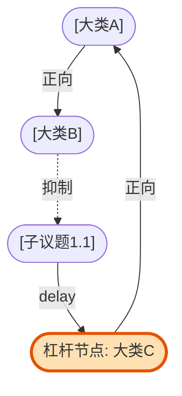

# 02_system_mapper 规范

本模块基于 Peter Senge 的《第五项修炼》与 Donella Meadows 的《系统之美》系统动力学理论。

## 📥 输入格式

- 读取 `from_01_mece` 中的节点列表及割裂点。

## ⚙️ 执行标准

### 1. 关系定义规范

使用因果回路图 (Causal Loop Diagram) 规范：

- **正向强化 (+)**: 节点 A 增加导致节点 B 增加。
- **负向抑制 (-)**: 节点 A 增加导致节点 B 减少。
- **时滞 (delay)**: 影响不是立竿见影，存在时间差。

### 2. 系统反馈环路识别

必须在因果网络中提取出：

- **增强回路 (Reinforcing Loop, R)**: 自我强化的增长/崩溃引擎。
- **调节回路 (Balancing Loop, B)**: 趋向平衡和稳定的自调节机制。

### 3. 系统杠杆点 (Meadows 理论)

判定干预优先级：

- **Level 1 (参数调整)**: 修改指标数值（低效）。
- **Level 2 (环路设计)**: 增加反馈、切断恶性环路（高效）。
- **Level 3 (重塑系统终极目标)**: 彻底改变游戏规则（最高效）。

## 📤 输出规范

使用高颜值 `Mermaid` 绘制因果图：

### 🧠 系统洞察分析

1. **核心回路分析**：[详细拆解 R1/B1 环路的形成机理]
2. **高价值干预杠杆 (Level 2/3)**：[指出应该干预哪个节点，为什么能够牵一发动全身]